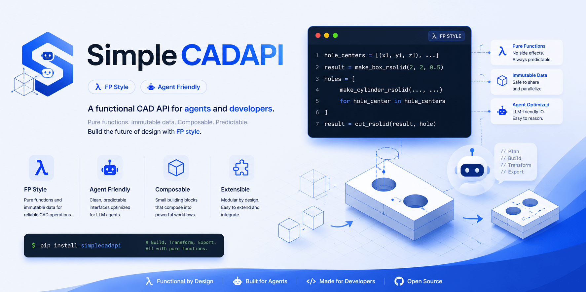

<p align="center">
  
</p>

# SimpleCADAPI

[中文说明](README.zh-CN.md)

## Update Notes (2.0.4b2 development)

> **Beta release:** Review reconstructed geometry and generated CAD documents
> before using this version in production.

SimpleCADAPI 2.0.4b2 adds an Agent-oriented STEP/BREP reconstruction workflow
with stable entity IDs, 17 schema-validated inspection and diagnostic tools,
focused material/boundary/topology acceptance gates, and replayable
interpolated B-spline profiles. See the
[full English update notes](docs/updates/2.0.4b2.md) for implementation details,
operating modes, limitations, and verification coverage.

---

<div align="center">
  <h2>SimpleCADAPI Research Artifact</h2>
  <p>This repository is an artifact of</p>
  <p>
    <strong><a href="https://arxiv.org/abs/2608.00891">CADIR: A Cross-Backend Editable Intermediate Representation for Agentic CAD Generation</a></strong>
  </p>
</div>

---

SimpleCADAPI is an OCP-native Python SDK for building CAD models with clear,
functional operations and replayable model graphs. It wraps OpenCascade geometry
in a compact public API for creating solids, applying features, tagging semantic
intent, querying topology, exporting manufacturing files, and translating recorded
models into FreeCAD workflows.

Current published beta release: `simplecadapi==2.0.4b1`. The 2.0.4b2 notes
describe the next beta while it is under validation.

## What It Provides

- OCP-native shape types: `Vertex`, `Edge`, `Wire`, `Face`, and `Solid`.
- Functional modeling operations for primitives, profiles, extrude, revolve,
  loft, sweep, booleans, transforms, patterns, fillets, chamfers, and shells.
- Replayable modeling with `@model`, `ModelResult`, `capture_result(...)`,
  `import_model_json(...)`, and `replay_model_json(...)`.
- Expression parameters with `var(...)`, arithmetic expressions, and serialized
  expression graphs.
- Physical units with automatic dimension inference, canonical CAD conversion,
  and manufacturing tolerance-chain validation.
- QL selectors for geometry grounding, topology queries, and stable feature
  selections.
- Semantic tags through `apply_tag(shape=..., tag=...)` and `list_tags(shape=...)`.
- STEP/STL export and FreeCAD translation helpers for script or `.FCStd` output.
- Agent-oriented STEP/BREP reconstruction with stable entity IDs, focused local
  diagnostics, highlighted region renders, and measured acceptance gates.
- Replayable open and periodic interpolated B-spline Edges/Wires for freeform
  profiles and Loft sections.

## Install

```bash
pip install simplecadapi
```

With `uv`:

```bash
uv add simplecadapi
```

For local development from this repository:

```bash
uv sync --group dev
```

## Quick Start

```python
from pathlib import Path

import simplecadapi as scad

out = Path("out")
out.mkdir(exist_ok=True)

base = scad.make_box_rsolid(
    width=60.0, height=36.0, depth=8.0, bottom_face_center=(0.0, 0.0, 0.0)
)
hole = scad.make_cylinder_rsolid(
    radius=5.0, height=14.0, bottom_face_center=(0.0, 0.0, -3.0)
)
slot = scad.make_box_rsolid(
    width=18.0, height=8.0, depth=14.0, bottom_face_center=(14.0, 0.0, -3.0)
)

part = scad.cut_rsolid(base, hole, slot)
boss = scad.make_cylinder_rsolid(
    radius=8.0, height=7.0, bottom_face_center=(-18.0, 0.0, 8.0)
)
part = scad.union_rsolid(part, boss)
part = scad.apply_tag(shape=part, tag="role.demo.bracket")

print("volume", round(part.get_volume(), 3))
print("faces", len(part.get_faces()))
print("tags", scad.list_tags(shape=part))

scad.export_step(shapes=part, filename=str(out / "bracket.step"))
scad.export_stl(shapes=part, filename=str(out / "bracket.stl"))
```

## Replayable Modeling

Use one `@scad.model` entry point when a model should be inspectable,
serializable, replayable, or translated into another CAD environment. The
decorated function owns its `GraphSession` and returns a `ModelResult`.

```python
import simplecadapi as scad
from simplecadapi import ql as Q

@scad.model(graph_id="chamfered_block")
def build_model():
    body = scad.make_box_rsolid(
        width=40.0, height=24.0, depth=10.0,
        bottom_face_center=(0.0, 0.0, 0.0),
    )
    cutter = scad.make_cylinder_rsolid(
        radius=4.0, height=16.0, bottom_face_center=(0.0, 0.0, -3.0)
    )
    drilled = scad.cut_rsolid(body, cutter)

    bottom_circle = (
        Q.edges()
        .where(Q.curve_type(kind="circle"))
        .order_by(Q.center_axis(axis="z"))
        .take(1)
        .exactly(1)
    )
    final = scad.chamfer_rsolid(solid=drilled, edges=bottom_circle, distance=0.6)
    scad.capture_result(value=final)
    return final

result = build_model()
model_json = result.model_json
rebuilt = result.replay()

print("recorded_nodes", result.session.graph.node_count)
print("replayed_outputs", len(rebuilt))
```

Pass `export_dir=...` to `@scad.model` when the invocation should also write
one self-contained `<graph_id>.scene.zip`. The package contains `scene.json`,
`model/model.json`, the complete project-relative Python files referenced by
operation source mappings under `sources/`, and the GLB/entity assets required
by the Viewer. Automatic export does not write adjacent model/session JSON,
STEP, STL, or FCStd files; those explicit export APIs remain available. The
package path is `result.artifact_paths["scene"]`. Without `export_dir`, model
execution remains in memory.

## STEP/BREP Inspection

Install the optional rendering dependency when synchronized STEP views,
highlighted regions, or slice overlays are needed:

```bash
pip install "simplecadapi[inspect]"
```

Inspection lives under `simplecadapi.inspect.brep`. These APIs are diagnostic
tools, not modeling operations: they do not enter the graph and are rejected
inside `GraphSession` and `@model`. Export or obtain the geometry first, then
inspect it outside the modeling script.

Choose calls from the evidence required by the case instead of following a
fixed reverse-engineering pipeline. Start with bounded global and local facts;
add sections, component renders, boundary distance, material difference, or
strict topology comparison only when those facts answer the current question.

```python
from simplecadapi.inspect import brep

summary = brep.inspect_step_rsummary(
    path="target.step",
    include_parameter_groups=True,
)
face = brep.inspect_step_entity_rdescriptor(
    path="target.step",
    entity_id="face:0",
)

print("faces", summary["face_count"])
print("carrier", face["geometry"]["type"])
```

Use the [Reconstruction Agent test specification](docs/guides/reconstruction-agent-test-prompt.md)
for controlled runs and the [STEP BREP reverse-engineering guide](docs/guides/step-brep-reverse-engineering.md)
for the inspection primitives, modeling loop, replay checks, and acceptance gates.

## Physical Units And Tolerances

Declare nominal and manufacturing-tolerance units at the variable boundary.
SimpleCAD evaluates lengths in millimeters and angles in degrees while preserving
the declaration units in model JSON:

```python
import simplecadapi as scad

width = scad.var(
    "width",
    1.0,
    unit="in",
    tolerance=0.1,
    tolerance_unit="mm",
)
height = scad.var("height", 40.0, unit="mm", tolerance=0.2)
diagonal = scad.sqrt(width**2 + height**2)

analysis = scad.analyze_tolerance(diagonal)
check = scad.check_tolerance(diagonal, 0.3, tolerance_unit="mm")

print(analysis.dimension.name, analysis.unit.symbol)
print(analysis.nominal, analysis.lower_bound, analysis.upper_bound)
print("passes", check.passed)
```

Addition and subtraction require matching dimensions. Multiplication, division,
integer powers, and square root derive dimensions. Trigonometric functions require
angle or dimensionless inputs as appropriate. Legacy variables without `unit`
remain supported, but cannot be mixed with unit-declared variables in one
expression.

## Modeling Mental Model

- Start from design intent: reference axes, critical profiles, and the features
  that produce the final solid.
- Build from lower-dimensional geometry to higher-dimensional geometry: profile
  wires/faces first, then solid features such as extrude, revolve, loft, and
  sweep.
- Keep operations functional. Create new values with public functions such as
  `make_rectangle_rface(...)`, `extrude_rsolid(...)`, `cut_rsolid(...)`, and
  `fillet_rsolid(...)`.
- Use tags for semantic intent and selection anchors, for example
  `role.mounting.surface`, `anchor.datum.primary`, or `group.fasteners`.
- Store numeric and geometric facts in metadata or graph payloads, not in tags.
- Use QL to ground selections by geometry facts rather than relying on topology
  iteration order.
- When an indexed topology pick is intentional, pass the index to the plural
  child-geometry getter, such as `get_edges(index)`, `get_faces(index)`,
  `get_wires(index)`, or `get_vertices(index)`, so replayable graph workflows
  preserve the pick as a geo select node.
- Use model JSON as the interchange boundary for replay, tests, and FreeCAD
  translation.

## FreeCAD Translation

Recorded model JSON can be translated into a FreeCAD Python script:

```python
script = scad.translator.freecad_translator.translate_model_json_to_freecad_script(model_json)
```

If FreeCAD or FreeCADCmd is available, the same model JSON can be written as an
`.FCStd` file:

```python
scad.translator.freecad_translator.translate_model_json_to_fcstd(model_json, "bracket.FCStd")
```

Part/Assembly models are written as editable FreeCAD assembly structure: parts are
`App::Part`, assemblies are `Assembly::AssemblyObject`, and components are links.
Explicit compound projections remain available for geometry-only STEP export.

## Examples

Run examples from the source checkout:

```bash
uv run python examples/04_dimension_tolerance_chain.py
uv run python examples/08_constrained_sketch.py
uv run python examples/09_naca0016_blade_freecad.py
uv run python examples/10_part_assembly.py
uv run python examples/16_compact_two_stage_planetary_reducer/main.py
uv run python examples/20_integrated_bldc_joint_actuator/main.py
```

## Documentation

- 2.0.4b2 update notes: [`docs/updates/2.0.4b2.md`](docs/updates/2.0.4b2.md)
- Reconstruction Agent test specification:
  [`docs/guides/reconstruction-agent-test-prompt.md`](docs/guides/reconstruction-agent-test-prompt.md)
- STEP BREP reverse-engineering guide:
  [`docs/guides/step-brep-reverse-engineering.md`](docs/guides/step-brep-reverse-engineering.md)
- Public API reference: [`docs/api/`](docs/api/)
- Core type and modeling notes: [`docs/core/`](docs/core/)
- Serialization and replay details:
  [`docs/core/serialization/README.md`](docs/core/serialization/README.md)
- Dimension tolerance chains:
  [`docs/core/dimension-tolerance-chains.md`](docs/core/dimension-tolerance-chains.md)
- Physical units and dimension inference:
  [`docs/core/physical-units.md`](docs/core/physical-units.md)
- Operation graph JSON spec:
  [`docs/core/operation_graph_json_spec.md`](docs/core/operation_graph_json_spec.md)

## Releasing the Agent Skill

The repository includes a thin Agent Skill under `skills/simplecadapi/`. It
contains generated API and modeling references, but does not bundle the SDK
source code.

From a clean checkout, update the project version and documentation, then build
and validate the release artifacts:

```bash
uv sync --group dev
uv run skill-pack --refresh-docs --archive
uv run python -m pytest test/test_skill_pack.py
```

The command refreshes the generated docs, rewrites `skills/simplecadapi/`, and
creates `skills/simplecadapi.tar.gz`. Review the generated `SKILL.md` and
references before release:

```bash
git diff -- skills/simplecadapi docs
tar -tzf skills/simplecadapi.tar.gz
```

Commit the generated `skills/simplecadapi/` directory and refreshed `docs/`
with the release. The archive is intentionally ignored by Git; attach
`skills/simplecadapi.tar.gz` to the corresponding GitHub release or distribute
it through the target Agent Skills registry.

## Development

```bash
uv sync --group dev
uv run python -m pytest test tests
python3 -m compileall src/simplecadapi
```

## License

AGPL-3.0, see [`LICENSE`](LICENSE).

## Community

The group chat currently has too many members for direct QR-code joining. Scan the QR code below to add Teacher Du Peng on WeChat, then ask him for an invitation to the CADDesigner technical community:

<p align="center">
  
</p>
